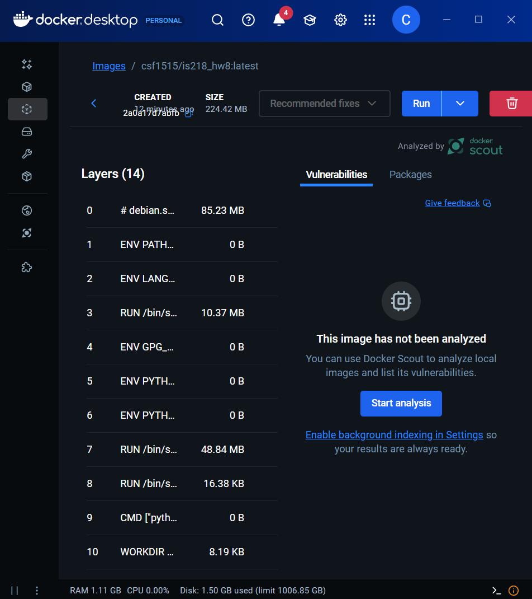
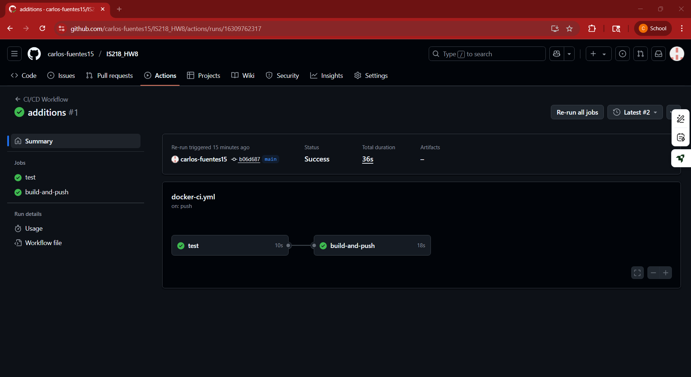

# IS218_HW8 - Docker CI/CD Pipeline

This project demonstrates setting up a CI/CD workflow using GitHub Actions and DockerHub.

---

## DockerHub Repository

[https://hub.docker.com/r/csf1515/is218_hw8](https://hub.docker.com/r/csf1515/is218_hw8)

---

## QR Code to DockerHub

---

## DockerHub Image

---

## GitHub Actions Workflow Log

